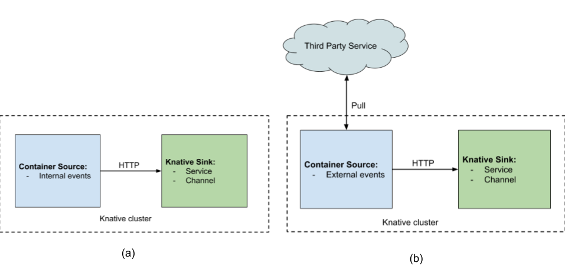

## How To Write Knative Container Sources

[Container Sources](https://github.com/knative/docs/tree/master/eventing#containersource) as mentioned in the official documentation:

> ... instantiate a container image which can generate events until the ContainerSource is deleted. This may be used (for example) to poll an FTP server for new files or generate events at a set time interval.

These types of event sources are described in so-called `ContainerSource` object manifest (e.g [`manifest.yaml`](./bash/manifest.yaml)) and can be deployed to your Knative cluster with the single command `kubectl apply -f manifest.yaml`.

This repository contains a collection of Container sources for knative eventing. They are meant to be an introduction to writing event sources.

In this repository will use the term _Container Source_ to describe a Knative event source of the kind `ContainerSource`.

## Collection Samples

Each directory showcases the use of a different language as well as different ways to send events.

Each directory contains a `Dockerfile` to build the event source container image

Each directory contains a `manifest.yaml` manifest to deploy the event source

* [bash](./bash)
* [bash with cloudevents](./bash-ce)
* [python](./python)

## Concepts

## Technical Tips

The Knative event controller which handles Container Sources handles the destination for events using the `sink` object referenced in the manifest. This sink is automatically discovered and referenced as an argument to the container *and* as an environment variable.

This leads to two technical details

- Use ENTRYPOINT and not CMD in your Dockerfile, otherwise the `--sink` will be parsed as an executable and not an argument
- You can use the environment variable SINK which gives you the address of the sink defined in the manifest

## Support

We would love your feedback on this tool so don't hesitate to let us know what is wrong and how we could improve it, just file an [issue](https://github.com/sebgoa/ksources/issues/new)

## Code of Conduct

This plugin is by no means part of [CNCF](https://www.cncf.io/) but we abide by its [code of conduct](https://github.com/cncf/foundation/blob/master/code-of-conduct.md)
